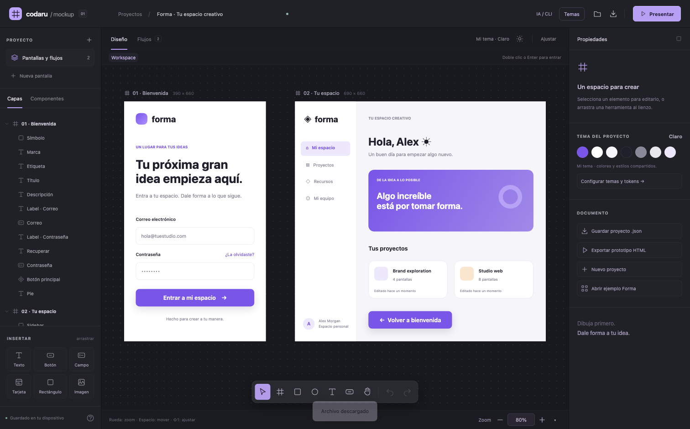

# Codaru Mockup · 0.3

Editor local de maquetas de interfaz, diseñado para integrarse dentro de una aplicación Tauri existente. TypeScript, HTML/CSS y SVG, sin dependencias de interfaz en ejecución. Incluye un paquete embebible, un plugin Rust opcional y una aplicación macOS de ejemplo. La aplicación compilada no necesita Node, un servidor, una cuenta ni conexión a Internet.

```sh
npm install codaru-mockup
npx codaru-assets public/codaru
```

Licencia **BSD-3-Clause**. Los iconos Material y Lucide conservan sus licencias; consulta [los avisos de terceros](THIRD-PARTY-NOTICES.md).



## Integrar en tu app Tauri

`npm run package:build` genera **`packages/editor/dist/`**: módulo `mountCodaru`, editor, declaraciones TypeScript y licencias, sin empaquetar otra app Tauri. `npm run package:pack` crea el archivo instalable en `artifacts/`. El plugin **`packages/tauri-plugin-codaru/`** añade diálogos de archivos y el puente local para el CLI a tu proceso existente. No crea ventanas ni otro proceso de servidor.

Consulta [la guía de integración](packages/editor/README.md) para instalar el paquete, copiar sus assets, montar/desmontar el editor, recibir cambios y registrar el plugin con sus permisos. `examples/tauri-host.html` y `examples/tauri-host.ts` muestran esa integración funcionando. El iframe local del mismo origen aísla estilos y atajos; no representa una frontera de seguridad ni una nueva ventana Tauri.

Desde 0.2 también puedes integrar el editor **por piezas, sin iframe**: `codaru-mockup/core` es el motor sin interfaz y `codaru-mockup/modular` monta lienzo, capas, inspector, biblioteca y barras en contenedores de tu IDE, con una sola sesión compartida y la apariencia de tu app. Consulta [la guía modular](docs/INTEGRATION.md) y el ejemplo `examples/modular-host.html`.

La distribución embebible y la app de ejemplo tienen pesos distintos. `artifacts/embedded-size.json` se regenera con tamaños medidos del runtime y del paquete completo. El CLI es opcional si tu agente ya accede a la API de la aplicación anfitriona.

## Abrir

La aplicación de ejemplo compilada está en `src-tauri/target/release/bundle/macos/Codaru Mockup.app`. Ahora abre el host con el editor integrado y botones para consultar contexto y desmontar/remontar la vista. La clave explícita de persistencia conserva el borrador anterior.

El ejemplo `examples/Forma.codaru.json` contiene dos pantallas conectadas y un botón reutilizable. Se puede abrir desde la carpeta de la barra superior. El editor recupera el borrador local del último uso; Guardar descarga un JSON en el navegador y abre un diálogo nativo en macOS.

## Primer recorrido

1. Abre el ejemplo Forma. Pulsa **Presentar** y **Entrar a mi espacio** para recorrer ambas pantallas.
2. Pulsa **R** y arrastra dentro de una pantalla. Cambia el tamaño, radio, relleno o gradiente en Propiedades.
3. Inserta texto con **T**. Haz doble clic en el texto para escribir directamente, o edítalo desde el inspector.
4. Selecciona varios elementos con **Shift + clic**. **⌘G** los agrupa. Un grupo puede distribuir a sus hijos en fila o columna con padding y separación.
5. Usa **Crear componente** sobre un elemento o grupo. Inserta copias desde la pestaña Componentes. Editar el maestro actualiza sus instancias; los campos modificados en una instancia se conservan.
6. Abre **Temas** en la barra superior para configurar colores, degradados, materiales, tipografía y radios. Los valores vinculados se actualizan juntos.
7. Selecciona un botón y elige su pantalla de destino en **Al hacer clic**. La pestaña Flujos muestra las conexiones.
8. Guarda el JSON editable o exporta el **prototipo HTML**, que se abre directamente desde disco sin servidor. Una pantalla seleccionada puede exportarse como SVG.

Atajos adicionales: **V** seleccionar, **F** pantalla, **O** elipse, **B** botón, **Espacio + arrastrar** mover lienzo, **⌘D** duplicar, **⌘Z / Shift + ⌘Z** deshacer/rehacer, **flechas** mover 1 px, **Shift + flechas** mover 10 px, **⌘S** guardar. **Alt** durante el arrastre evita el ajuste de posición de 4 px. El botón `?` muestra los atajos. En Windows/Linux se usa Ctrl en lugar de ⌘.

## Selección por niveles

- En **Workspace**, un clic selecciona la pantalla completa, incluso sobre su contenido. **Shift + clic** o un rectángulo desde el espacio exterior permiten seleccionar varias pantallas y moverlas juntas.
- **Doble clic** o **Enter** sobre una pantalla, grupo o componente abre su contenido. También está el botón **Entrar y seleccionar hijos** del inspector.
- Dentro de ese nivel, arrastra desde un espacio vacío para seleccionar varios hijos directos. **Shift + clic** añade o quita elementos; **Shift + arrastrar** añade otra zona. **⌘/Ctrl + A** selecciona los hijos disponibles del nivel activo.
- Los grupos y componentes se seleccionan como una unidad hasta entrar en ellos. Funciona también con grupos anidados y con los hijos de una instancia.
- **Escape** vuelve al nivel padre y selecciona el contenedor del que sales. La ruta `Workspace / Pantalla / Componente` permite volver directamente a cualquier nivel. Un clic fuera del contenedor vuelve al nivel exterior correspondiente.
- El título de una pantalla permite seleccionarla desde cualquier nivel. Las capas permiten acceder directamente a un elemento y sitúan la selección en su contenedor.
- El rectángulo de selección muestra el resultado durante el arrastre, solo incluye hijos del nivel activo y omite elementos bloqueados u ocultos. Escape durante un arrastre cancela el gesto.

Para editar un texto directamente, entra primero en su pantalla o grupo y haz doble clic sobre él. Las teclas Escape y Enter conservan su función de edición cuando el foco está en un campo.

## Revisión de diseño

Sin nada seleccionado, «Revisar el diseño» analiza todas las pantallas y lista los hallazgos por pantalla; el mapa de calor los marca sobre el lienzo y al pulsar uno se va a su elemento.

- **Contraste** de cada texto contra su fondo real, en claro y en oscuro. Indica cuándo solo falla en un modo, que suele deberse a un color fijo.
- **Zonas táctiles** de menos de 44 × 44, **texto** de menos de 11 px o que no cabe en su caja.
- Contenido **recortado**, bajo el **área del sistema** o cruzando el **pliegue**, y acciones superpuestas.
- **Coherencia**: colores casi iguales a un token sin vincular, bordes casi alineados y demasiados tamaños o radios.
- **Degradado embarrado**: una rampa de un neutro oscuro a un acento cálido (negro a oro) pasa por oliva a mitad de camino; usa tonos de un mismo color.
- **Acento como fondo**: un chip pequeño relleno con un acento cálido (oro, ámbar) y texto oscuro encima parece una señal de aviso aunque contraste; en pequeño el acento va como texto, icono, borde o tinte.
- **Paleta**: el color principal del tema debe contrastar 3:1 con el fondo y ser un acento saturado o un neutro oscuro; un tono medio apagado (marrón, ocre, gris) deja todo el diseño en una sola banda tonal.

`./codaru lint` devuelve lo mismo en JSON con una corrección sugerida por hallazgo. El plugin de [packages/claude-plugin](packages/claude-plugin/README.md) enseña a un agente a diseñar y a revisar con estas reglas.

## Maquetas en Markdown

Un bloque ```` ```codaru-mockup ```` con `archivo`, `pantalla` y `modo` muestra una pantalla dentro de un documento. La entrada `codaru-mockup/preview` lo convierte en una vista previa en vivo, navegable o estática, sobre el HTML de cualquier motor de Markdown. Consulta [docs/MARKDOWN.md](docs/MARKDOWN.md).

## Auto layout

Un contenedor (pantalla, tarjeta o grupo) puede organizar a sus hijos en fila o columna desde «Distribución»:

- **Padding** único o por lado, y **espacio** entre hijos.
- **Reparto** a lo largo: al inicio, centrado, al final o repartido.
- **Alineación** transversal: estirar, al inicio, centrada o al final.
- **Pasar a otra línea** cuando los hijos no caben.
- **Ajustar al contenido** en ancho, alto o ambos.
- Cada hijo puede ser fijo o **llenar** el espacio, con tamaño mínimo y máximo.

## Importar desde Figma

Cada persona puede traer sus propios archivos con el plugin de [packages/figma-plugin](packages/figma-plugin/README.md): se instala en Figma desde su manifiesto, exporta un `.figma.codaru.json` sin token ni red, y Codaru lo abre con «Abrir proyecto». La importación se añade al documento, convierte los estilos en tokens y resume qué se simplificó.

## Importar una web o una app existente

`packages/claude-plugin/skills/codaru-clone/scripts/snapshot.js` se ejecuta dentro de cualquier página (consola del navegador, herramienta de JavaScript de un agente, Playwright) y devuelve una instantánea de lo visible: geometría, fondos y degradados, bordes, radios, sombras, tipografía, textos, SVG en línea e imágenes del mismo dominio. `codaruSnapshot({ download: true })` descarga `pagina.dom.codaru.json`. No envía nada a ningún sitio.

La operación `dom` de `./codaru apply` importa esa instantánea como una pantalla del tamaño del viewport, con un tema `Importado · dominio` derivado de los colores y las tipografías de la página y las capas vinculadas a esos tokens. Lo que no se puede capturar (imágenes de otro dominio, fondos CSS, cursivas, fuentes propias) queda anotado. Con el skill `codaru-clone`, un agente puede replicar tu app pixel a pixel para rediseñarla, o extraer la ficha de marca de un sitio y diseñar tu producto con ese estilo sin copiarlo.

## Dispositivos y plegables

- **Tamaño de pantalla**: al seleccionar una pantalla, «Dispositivo» ofrece tamaños de iPhone, iPad, teléfonos y tabletas Android, plegables y escritorio, en puntos o dp. «Girar» intercambia ancho y alto.
- **Plegables**: una pantalla puede tener un pliegue vertical (libro) u horizontal (tapa) con el ancho de su bisagra. El lienzo dibuja la línea para no colocar contenido clave encima.
- **Desplegar y plegar**: diseña la pantalla cerrada y la abierta como dos pantallas, conéctalas y elige la transición «Desplegar» o «Plegar»; la pantalla con pliegue se abre o se cierra en dos mitades.
- **Área segura y marco**: cada tamaño trae el espacio que reserva el sistema y un marco de dispositivo. El lienzo marca el área segura con bandas; al presentar se ve el bisel, la barra de estado, la cámara y el indicador de inicio.
- **Ver las dos posturas**: empareja la pantalla plegada con la desplegada en «Otra postura»; al presentar aparece un botón para alternar entre ellas.
- **Ejemplo**: «Ejemplo iOS, Android y plegables» abre Forma recreado para 21 pantallas: iPhone, iPhone Duo, teléfono Android, Pasaporte, Flip y Tríptico en cada postura.
- **Categorías de plegables**: iPhone Duo, y en Android Pasaporte (libro), Flip (almeja) y Tríptico (doble bisagra). Un pliegue puede tener dos o tres paneles; un tríptico tiene tres posturas enlazadas.
- Los tamaños de Android de referencia son los de Android Studio. Los marcados con ≈ son aproximados: los del iPhone Duo salen de sus resoluciones publicadas suponiendo escala 3x, y los de plegables Android concretos se calcularon desde píxeles y densidad.

## Animación

- **Transiciones**: al conectar un elemento con otra pantalla, elige en «Al hacer clic» cómo se pasa de una a otra (disolver, deslizar, escalar), su duración y su curva.
- **Ilustraciones**: «Insertar → Ilustración» sube un SVG. El editor lo sanea, lo guarda dentro del proyecto y convierte cada forma en una capa animable.
- **Animador**: «Abrir animador» en Propiedades edita animaciones por fotogramas clave sobre una capa o el elemento entero, con vista previa en vivo y bases listas (aparecer, deslizar, latido, girar, flotar, dibujar trazo y esqueleto de carga). Cada fotograma puede cambiar el color de relleno y de borde, con HEX o tokens del tema.
- Todo se reproduce en **Presentar** y en el **HTML exportado**. El lienzo y la exportación SVG permanecen estáticos. No se añade ninguna dependencia: se usa la API de animación del navegador.
- Una IA puede hacer lo mismo con `./codaru apply`; consulta [CLI.md](CLI.md).

## Zoom y movimiento del lienzo

- **Rueda o dos dedos en el trackpad**: mover el lienzo en vertical y horizontal. **Shift + rueda**: desplazamiento horizontal con un ratón.
- **⌘/Ctrl + rueda** o pellizco de trackpad: acercar o alejar conservando el punto bajo el cursor.
- **+ / −**: acercar o alejar. **0**: escala 100%. También funcionan con ⌘/Ctrl.
- **Shift + 1**: ajustar todas las pantallas. **Shift + 2**: ajustar la selección, incluidos elementos dentro de grupos.
- **Espacio + arrastrar** o herramienta Mano: mover el lienzo arrastrando.
- Abajo a la derecha, escribe un porcentaje entre **10% y 800%** y pulsa Enter. Escape cancela la edición. El desplegable ofrece escalas predefinidas y ajuste de vista.

El zoom cambia la vista; conserva las medidas del documento, el historial y el texto que estés editando. El pellizco nativo usa los [eventos de gesto de WebKit](https://developer.apple.com/documentation/webkitjs/gestureevent), además de Ctrl + rueda en navegadores Chromium.

## Temas, degradados y vidrio

**Temas** abre el editor del sistema de diseño. El selector **Perfil** elige qué tema editar y **Modo a editar** separa claro y oscuro. **Duplicar tema** crea un perfil independiente; puedes renombrarlo y pulsar **Usar en documento**. El modo a editar no cambia por sí solo el modo del documento: ese cambio sigue en el botón de sol/luna.

El editor ofrece cinco tipos de tokens:

- **Colores:** HEX, `transparent` o referencias como `@primary`. No se permiten referencias inexistentes ni ciclos.
- **Degradados:** lineales y radiales, ángulo y entre 2 y 16 paradas. Cada parada tiene color o referencia y una posición de 0 a 100%. Las paradas se ordenan automáticamente.
- **Materiales:** tinte, porcentaje de tinte, desenfoque, saturación, borde y sombra. El token `glass` simula vidrio mediante transparencia y `backdrop-filter`; coloca contenido detrás para apreciar el desenfoque. No reproduce la refracción dinámica de Liquid Glass.
- **Tipografía:** familia del sistema, serif o mono, tamaño, peso e interlineado. No descarga fuentes.
- **Radios:** valores reutilizables para controles y paneles.

Escribe un identificador en la lista lateral y pulsa **Crear token** para añadirlo a ambos modos. Edita después sus valores de forma independiente. Los cambios admiten Deshacer y se guardan con el proyecto.

Selecciona un elemento y usa **Tokens** en Propiedades para vincular relleno, material, radio o tipografía. Un vínculo controla su propiedad; elige **Sin vínculo** para volver al valor manual. Selecciona una pantalla para elegir **Tema de pantalla** y **Modo de pantalla**, o aplicar directamente el tema de un kit. Un tema explícito en la pantalla prevalece sobre el tema inicial de los componentes prefabricados.

El formato editable ahora es v2. Los borradores y archivos v1 se migran al abrirlos conservando las paletas y el contenido. Los degradados locales de dos colores siguen funcionando.

## Variantes de componente

Un componente puede tener **variantes**: estados o tamaños que comparten estructura (Normal, Seleccionado, Deshabilitado; Pequeño, Grande). En el inspector de un maestro, **◇ Nueva variante** duplica el maestro junto al original como otra definición del mismo conjunto; cada eje (Estado, Tamaño…) tiene su valor y **+ Eje** añade otro a todas las variantes. Una instancia muestra un selector por eje en **Variante** y cambia de definición conservando los textos y colores que hayas sobrescrito, emparejados por nombre de capa. Los kits forman un conjunto por elemento con el eje Estado, así que una instancia de kit pasa de Normal a Seleccionado desde el inspector. En Componentes, cada conjunto aparece agrupado con sus variantes.

## Componentes prefabricados

En **Componentes → Kits de diseño**, elige iOS, macOS, Android, Linux o Web. Cada kit contiene 20 componentes originales editables: botones, campos, búsqueda, interruptores, casillas, opciones, deslizadores, progreso, etiquetas, avatares, listas, tarjetas, pestañas, navegación, barras, diálogos, avisos, paneles laterales, ventanas y menús. Linux toma referencias visuales de GNOME/Adwaita; no representa todas las distribuciones.

Selecciona un estado visual (normal, seleccionado o deshabilitado), busca por nombre/categoría y pulsa o arrastra un componente al lienzo. El documento incorpora solo las definiciones usadas; repetir una inserción reutiliza la misma definición. Cada instancia permite editar sus hijos entrando por niveles. Para personalizar solo una copia, cambia sus propiedades; para convertirla en formas independientes, usa **Desvincular**. Los kits no agregan maestros visibles al lienzo: sus definiciones permanecen en la biblioteca local.

Las variantes son dibujos de estados, no widgets nativos con comportamiento completo. Los kits son originales; no incluyen archivos oficiales de Apple, Google, GNOME ni recursos de terceros. El catálogo se carga bajo demanda y no requiere conexión.

`examples/kits-demo.codaru.json` ofrece cinco pantallas con los 100 componentes, distribuidos y etiquetados. Abrirlo usa el diálogo habitual de reemplazo, que permite conservar el documento anterior en Deshacer. Para regenerarlo: `npx tsx scripts/generate-kits-demo.ts`.

## Iconos e integración de IA

**Componentes → Iconos** contiene cuatro kits de 24 vectores: Mac y Linux originales, Google Material (Apache 2.0) y Web/Lucide (ISC). Busca por nombre o palabra clave, haz clic o arrastra al lienzo. El inspector permite cambiar su color, vincularlo a `@primary` u otro token, y ajustar su tamaño sin rasterizarlo. Las referencias a iconos se conservan en el JSON; HTML y SVG incluyen geometría vectorial y avisos de licencia para los paquetes utilizados. Las fuentes exactas, commits y licencias están en `vendor/licenses/`.

La IA sigue el recorrido **contexto → catálogo/esquema → validación → aplicación → revisión**:

```sh
./codaru context
./codaru catalog --kind icons --kit web
./codaru schema
./codaru apply --file cambios.json --dry-run
./codaru apply --file cambios.json
./codaru export --format svg --frame ID --output vista.svg
```

Cada lote JSON incluye `expectedRevision` y `operations`. La aplicación valida todo el lote, rechaza revisiones antiguas y devuelve IDs, cambios y contexto actualizado. Cada lote real admite Deshacer como una sola operación. El contexto es acotado para no enviar todo el diseño por cada cambio. El CLI nativo está verificado en macOS; su transporte Unix también se compila en otros Unix, pero Windows requiere una implementación adicional.

## Desarrollo

```sh
npm install
npm run dev
npm run check
npm test
npm run test:ui
npm run build
npm run package:build
npm run native:build
```

`npm run dev` sirve la vista de desarrollo en `http://127.0.0.1:1432`. La aplicación nativa de producción incorpora `dist/`; ese servidor solo se usa durante desarrollo. Compilar la aplicación nativa requiere Rust y las dependencias de Tauri de la plataforma. Las pruebas de interfaz usan Chromium de Playwright (`npx playwright install chromium` si no está instalado).

## Estructura e integración

- `src/model.ts`: documento, validación, historial, componentes, agrupación y distribución. No importa DOM ni frameworks.
- `src/render.ts`: renderizado HTML y exportación de HTML/SVG.
- `src/main.ts`: editor, gestos, inspector, persistencia y API para el host.
- `src/embed.ts`: montaje/desmontaje, ciclo de vida, API tipada y aislamiento de instancias.
- `packages/editor/`: paquete frontend distribuible, sin app Tauri adicional.
- `packages/tauri-plugin-codaru/`: plugin Rust para integrarse en un host Tauri existente.
- `src/selection.ts`: selección por contenedor, resolución de descendientes y selección rectangular.
- `src/themes.ts`: tokens, validación y resolución de tema por elemento y pantalla.
- `src/theme-editor.ts`: editor visual de perfiles y tokens.
- `src/kits.ts`: catálogo original de cinco plataformas, cargado bajo demanda.
- `src/icon-data.ts` / `src/icon-library.ts`: vectores y catálogo de iconos con licencias locales.
- `src/agent.ts`: contexto, operaciones por lotes, revisiones y contrato para IA.
- `src-tauri/src/cli.rs`: CLI opcional; comparte el transporte de la crate del plugin.
- `src/demo.ts`: documento de ejemplo.
- `src-tauri/`: aplicación anfitriona de ejemplo que registra el plugin.

Una IA puede usar el **CLI local `codaru`** para leer y modificar el documento abierto, consultar kits e iconos y recibir contexto actualizado. Mientras trabaja, el lienzo lo muestra: cada lote dibuja partículas que se asientan sobre lo que creó o cambió, los elementos nuevos aparecen con un fundido, las pantallas vacías que acaba de crear se ven como esqueleto hasta que las rellena y una píldora «Diseñando · N pantallas, N cambios» resume el progreso (al pasar el ratón, una burbuja la amplía). Solo reacciona a cambios del agente, nunca a los tuyos, y respeta «Reducir movimiento». **No incluye un modelo ni requiere MCP.** El CLI se comunica con la aplicación mediante un socket Unix privado; no requiere Node ni escucha en la red. El host de la vista web puede usar `window.codaru.agent(command, params)` con el mismo contrato. Consulta [CLI.md](CLI.md) o pulsa **IA / CLI** en la aplicación para ver el flujo completo.

```js
const selected = window.codaru.getSelection();
const project = window.codaru.getDocument();

// Todas las operaciones de apply forman una sola entrada en Deshacer.
window.codaru.apply([
  { op: 'update', id: 'primary-button', patch: { text: 'Comenzar', radius: 16 } }
]);

// También admite add, remove, component e instance.
window.codaru.apply([
  { op: 'add', node: {
      type: 'text', parentId: 'screen-login', name: 'Nota',
      x: 32, y: 625, width: 326, height: 20,
      text: 'Diseñado en Codaru', fontSize: 11, color: '@muted'
  } }
]);
window.codaru.select(['primary-button']);
```

Las operaciones inválidas se revierten íntegramente. Los proyectos importados validan jerarquías, destinos, colores, geometría y referencias. Los textos se dibujan como texto, y las imágenes admitidas son archivos locales PNG/JPEG/WebP/GIF de hasta 3 MB. El límite de importación es 20 MB y 3.000 elementos. El historial conserva 60 operaciones durante la sesión. Reemplazar un documento conserva el anterior en Deshacer; se recomienda exportar un archivo para conservar proyectos independientes.

## Alcance de este prototipo

Incluye formas básicas, textos, botones, campos, tarjetas, imágenes locales, grupos, componentes con instancias y sobrescrituras, cinco kits de 20 componentes, perfiles claro/oscuro por pantalla, tokens de colores/degradados/materiales/tipografía/radios, gradientes locales, radios por esquina, borde sólido, sombra exterior, fila/columna, alineación, distribución horizontal, bloqueo/visibilidad, zoom, conexiones, presentación, JSON, HTML y SVG.

Pendiente para siguientes iteraciones: variantes formales de componentes, componentes anidados, más iconos y variantes, copy/paste entre proyectos, guías inteligentes entre objetos, auto layout con ajuste al contenido y reglas adaptativas, múltiples rellenos/bordes, sombra interior configurable y chat de IA dentro de la app. El CLI ya permite conectar un agente externo. Los controles del mock son visuales; en Presentar los campos aceptan texto y los destinos definidos navegan. No hay backend ni autenticación real en las pantallas de ejemplo.

La exportación HTML utiliza el mismo renderizador que la presentación y conserva el vidrio simulado. SVG conserva geometría, texto, colores y las paradas de los degradados; simplifica los materiales a tinte y borde, y los saltos de texto y el recorte de imágenes pueden variar respecto a HTML. El formato JSON es la fuente editable.
