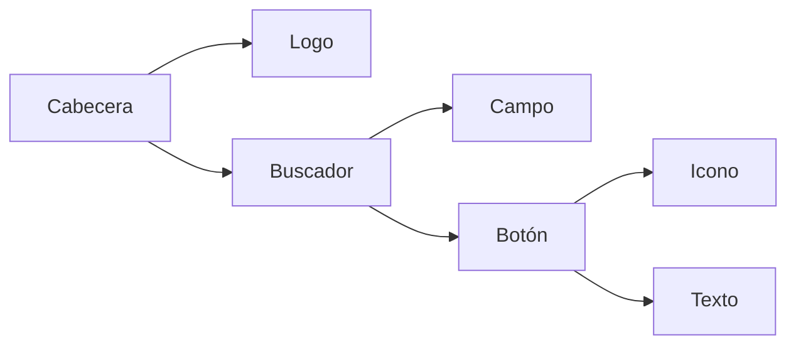
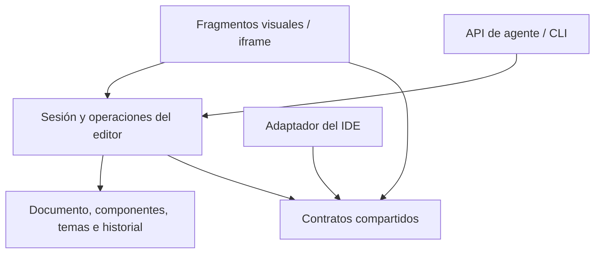

# Arquitectura de Codaru Mockup

Decisión 001 · 2026-10-07 · Adoptada como dirección del proyecto. La adopción es incremental; las etapas pendientes se indican abajo.

## Decisión

Usar **composición de componentes (Composite)** para construir diseños, con un **núcleo independiente de la interfaz** y **puertos y adaptadores** para integrarlo en el IDE. Se conserva una biblioteca TypeScript local, sin dependencias de interfaz en ejecución. Atomic Design queda como vocabulario opcional de organización.

Son responsabilidades distintas: la composición define cómo se construye un diseño; los puertos definen cómo el editor conversa con el IDE. No requieren frameworks adicionales.

## Fundamento de la elección

| Fuente primaria | Qué aporta | Aplicación en Codaru |
| --- | --- | --- |
| [Atomic Design, Brad Frost](https://atomicdesign.bradfrost.com/chapter-2/) | Presenta átomos, moléculas y organismos como un modelo mental, y recomienda evaluar las partes dentro de pantallas con contenido representativo. | Nombres, categorías y ejemplos de uso pueden organizar una biblioteca sin crear tipos de nodo obligatorios para cada nivel. |
| [Graphics View, Qt](https://doc.qt.io/qt-6/graphicsview.html) | Separa escena, vista y elementos; los elementos pueden contener hijos y utilizan coordenadas locales. | Conservar el árbol de nodos con identidad estable y geometría relativa al padre. La interpretación de este enfoque como Composite es nuestra elección de diseño. |
| [Composition, Radix](https://www.radix-ui.com/primitives/docs/guides/composition) | La composición reutiliza piezas y comportamientos mediante contratos; sustituir una pieza exige conservar interacción y accesibilidad. | Las piezas del editor deben poder montarse por separado manteniendo selección, eventos y foco. Es una referencia conceptual; Codaru continúa con TypeScript y DOM. |
| [Ports and Adapters, Alistair Cockburn](https://alistair.cockburn.us/hexagonal-architecture) | Una aplicación puede ser manejada por una interfaz, programas o pruebas mediante contratos, y probarse aislada de los dispositivos externos. | UI, agente y host acceden a una sesión; archivos, navegación del IDE y transporte nativo quedan en adaptadores. |

La elección responde a la integración embebida, el peso y la reutilización que necesita este proyecto. Estas fuentes respaldan los patrones; no establecen que exista una única tendencia dominante ni prueban el rendimiento de Codaru.

## Modelo de composición

Un diseño mantiene tres conceptos técnicos:

1. **Nodo:** elemento visual con ID, propiedades y un padre opcional. Un contenedor agrupa nodos.
2. **Definición de componente:** estructura reutilizable, variantes y documentación.
3. **Instancia:** uso de una definición con sus sobrescrituras explícitas.

Botón, buscador y cabecera usan esos mismos conceptos. Las etiquetas «átomo», «molécula» y «organismo» describen el papel de una pieza; no añaden una cadena de clases o reglas de inserción.

La composición objetivo permite reutilizar un botón dentro de un buscador y el buscador dentro de una cabecera:

**Implementado:** un maestro puede contener instancias de otras definiciones, a varios niveles. Cada maestro vive fuera de otros componentes; se compone insertando sus instancias. `componentKey` identifica una capa dentro de la instancia más cercana; la raíz de una instancia anidada pertenece al ámbito exterior. No se añaden campos ni se cambia el formato v1/v2.

Los valores de la plantilla son heredados; `overrides` conserva solo los cambios de ese uso. La sincronización sigue el orden de dependencias, actualiza también plantillas sin maestro visible y rechaza ciclos o expansiones por encima de 3.000 capas. Los cambios de variante mantienen los IDs de capas compatibles, emparejadas por ruta de nombre/tipo y posición entre hermanos homónimos. Las capas nuevas reciben nuevos IDs.

La selección, los textos y estilos se editan dentro de las instancias. Añadir, eliminar o reagrupar su estructura se hace en el maestro. Desvincular la instancia exterior conserva los componentes interiores y sus valores personalizados; para desvincular un componente dentro de otra instancia hay que editar el maestro o desvincular primero la exterior. El ejemplo `examples/nested-host.html` permite revisar esta integración sin persistencia implícita.

## Límites del motor y del host

Dirección de dependencias que deben conservar las nuevas capacidades:

Los puertos son funciones y tipos concretos. Por ejemplo, `onChange` entrega el documento al host; `onTranslationRequest` expresa la intención de abrir una clave. El IDE resuelve sus archivos y navegación y entrega un catálogo actualizado. «Abrir implementación» sigue esa separación mediante `onImplementationRequest`; el documento guarda referencias por plataforma y el IDE resuelve el destino.

| Responsabilidad | Propietario |
| --- | --- |
| Documento, validación, selección, componentes y una historia por sesión | Motor |
| Gestos, foco, renderizado, mediciones DOM y paneles desmontables | Vista |
| Archivos, guardado explícito, navegación a símbolos y catálogos de traducción | IDE |
| Socket, diálogos nativos y transporte `invoke` | Adaptador Tauri |
| Recursos, kits y exportadores adicionales | Módulo de la capacidad, cargado cuando corresponde |

`src/contracts.ts` contiene solo tipos: `EditorOperation`, `AgentRequest`, `AgentResponse` y el transporte opcional `CodaruInvoke`. `core`, `modular` e iframe comparten esos contratos. Los tipos que ya se podían importar desde el paquete raíz o `agent.ts` se siguen reexportando para mantener compatibilidad.

El estado mutable de cada sesión pertenece a su editor. Suscriptores y callbacks reciben copias. El catálogo y el idioma de vista previa son estado de sesión; el documento conserva claves y texto de origen. Los paneles pueden desmontarse conservando la sesión y deben confirmar ediciones pendientes antes de retirarse.

## Reglas para crecer

- **Componer por referencias y contratos.** Una nueva función no introduce clases distintas por plataforma o por nivel de Atomic Design.
- **Una transacción por cambio lógico.** Validar antes de confirmar; el historial sigue siendo compartido entre la UI, el host y la IA. El agente conserva revisión esperada y respeto por `editor_busy`.
- **Dependencias hacia el interior.** El núcleo y sus dependencias documentales no importan el iframe, los fragmentos, su runtime, estilos ni un SDK nativo, incluso para obtener tipos. Los tipos comunes viven en contratos neutrales.
- **Adaptadores pequeños y específicos.** El IDE recibe intenciones tipadas y decide sus efectos. No se añade un registro global de servicios o un bus de eventos sin una necesidad concreta.
- **Persistencia explícita y datos serializables.** Ninguna definición guarda callbacks, DOM, manejadores de archivo o código ejecutable. La compatibilidad con documentos v1/v2 se valida en cada cambio de modelo.
- **Extensiones con ciclo de vida.** Un módulo que monte controles o listeners debe poder desmontarlos y coexistir con otra instancia. Los kits y exportadores no se convierten en dueños del documento.
- **Medición en el consumidor.** Comprobar el paquete instalado desde un tarball; medir por separado distribución web, CLI y app nativa. Que una API sea modular no garantiza por sí solo menor peso o mejor rendimiento.

## Estado de la adopción

La sesión (`editor-core.ts`), vistas desmontables (`modular.ts`), API de agente, persistencia del host y traducciones externas ya ofrecen parte de esta separación.

En esta entrega se elimina una dependencia de tipos del núcleo hacia `embed.ts`, se consolidan contratos comunes y se incorporan pruebas automáticas de fronteras. Son cambios de organización y tipos, sin nuevas dependencias ni cambios del documento.

Quedan límites concretos: `editor-runtime.ts` concentra muchas funciones de interfaz y algunas operaciones todavía acceden directamente al `Store` de la sesión. Las APIs de exportación del núcleo conservan fachadas hacia renderizadores; HTML y ciertas exportaciones necesitan navegador al invocarlas. Las pruebas de fronteras evitan dependencias de UI y transporte, pero no pretenden demostrar ausencia total de APIs DOM en cualquier exportador. El motor documental se verifica por separado sin DOM.

## Orden de implementación

| Etapa | Alcance | Criterio para cerrarla |
| --- | --- | --- |
| 1. Contratos y fronteras | Contratos neutrales, importaciones compatibles y pruebas de dependencia. | El núcleo funciona sin vista; paquete y consumidores conservan sus imports. Implementado en esta entrega. |
| 2. Componentes anidados | Definiciones referenciables dentro de otras definiciones e instancias. | Detectar referencias cíclicas antes de confirmar; conservar IDs y sobrescrituras al propagar cambios, duplicar, cambiar variante, deshacer y exportar. Probar varios niveles y coste de actualización. Implementado; cubierto por pruebas de composición y ejemplo embebido. |
| 3. Propiedades públicas y espacios de contenido | Exponer texto, icono o contenido reemplazable sin recorrer capas internas. | Propiedades de texto, icono, visibilidad y variante implementadas; valores validados, inspector, API/CLI y controles del host. Slots implementados: un componente por espacio, opciones permitidas, predeterminado, sobrescrituras y validación de dependencias. Véanse COMPONENT-PROPERTIES.md y COMPONENT-SLOTS.md. |
| 4. Conexión con implementación | Referencias opcionales a símbolos/componentes por plataforma y una intención para abrirlos. | Implementado: referencias opcionales por plataforma, inspector, intención `onImplementationRequest`, API y CLI. El IDE resuelve la referencia; la IA recibe metadatos de las capas solicitadas. Véase IMPLEMENTATION-LINKS.md. |

En la etapa 2, la jerarquía visual y el grafo de referencias entre definiciones se validan por separado. Un árbol de padres válido no evita que A use B y B use A. La propagación debe seguir un orden de dependencias y conservar claves de instancia estables. Quitar únicamente la restricción actual no implementa esa capacidad.

## Verificación

`tests/architecture.test.ts` recorre importaciones estáticas, dinámicas y de tipos desde el núcleo; rechaza adaptadores visuales, estilos, SDKs o paquetes externos en ese grafo. También comprueba que `contracts.ts` desaparezca al compilar a JavaScript. Ambas pruebas forman parte de `npm test` y del CI existente.

Las pruebas del motor cubren transacciones e independencia de sesiones. Las de interfaz cubren montaje, foco, historial, localización e iframe. Los cambios con comportamiento visual requieren revisión de la app Tauri y de sus exportaciones. Cada nueva capacidad añade pruebas sobre sus invariantes, especialmente referencias, propagación y desmontaje.
